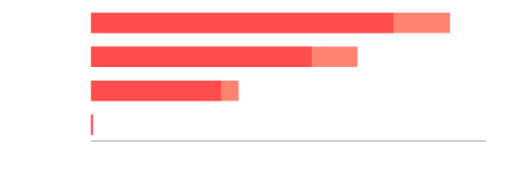

# pyvinorm

[](https://codecov.io/gh/hoang1007/pyvinorm)
[](https://pypi.python.org/pypi/pyvinorm)

A package for normalizing Vietnamese text into its spoken form. Based on [vinorm](https://github.com/v-nhandt21/vinorm_cpp_version.git), re-writen in Python.

<p align="center">
  <picture align="center">
    <source media="(prefers-color-scheme: dark)" srcset="./assets/benchmark_dark.svg">
    <source media="(prefers-color-scheme: light)" srcset="./assets/benchmark_light.svg">
    
  </picture>
</p>

## Why pyvinorm?
- ⚡️ pyvinorm is 50-100x faster than vinorm in single-threaded mode.
- ⚙️ pyvinorm supports multi-threading and multi-processing.
- 📦 pyvinorm is a pure Python package, make it simple to integrate into any workflows.

## Installation
Installing pyvinorm is easy with pip. Just run the following command:
```bash
pip install pyvinorm
```

## Usage
### Python
```python
from pyvinorm import ViNormalizer
normalizer = ViNormalizer(downcase=True)

normalizer.normalize("đhđbtq lần thứ XIII của ĐCSVN chính thức khai mạc sáng ngày 26/01/2021")

>>> đại hội đại biểu toàn quốc lần thứ mười ba của đảng cộng sản việt nam chính thức khai mạc sáng ngày hai mươi sáu tháng một năm hai nghìn không trăm hai mươi mốt
```

### CLI
pyvinorm also provides a command-line interface
```bash
>>> pyvinorm -h
usage: pyvinorm [-h] [--regex-only] [--keep-punct] [--downcase] text

Normalize Vietnamese text.

positional arguments:
  text          Text to normalize.

options:
  -h, --help    show this help message and exit
  --regex-only  Return only regex matches without normalization.
  --keep-punct  Keep punctuation in the output.
  --downcase    Convert the text to lowercase after normalization.
```

## FAQ
### Does pyvinorm support handling Out-of-Vocabulary (OOV) words?
No, during post-process stage, pyvinorm only checks if the word is a abbreviation, teencode or a symbol, then convert it to the original form. Otherwise, it will be kept as is.

For example, when normalizing the email `hoangvuhuy1007@gmail.com`, the result will be `hoangvuhuy một không không bảy a còng gmail chấm com`.

## Acknowledgements
This project is based on the original [vinorm](https://github.com/v-nhandt21/vinorm_cpp_version.git). Many thanks to @v-nhandt21 for the great work!
